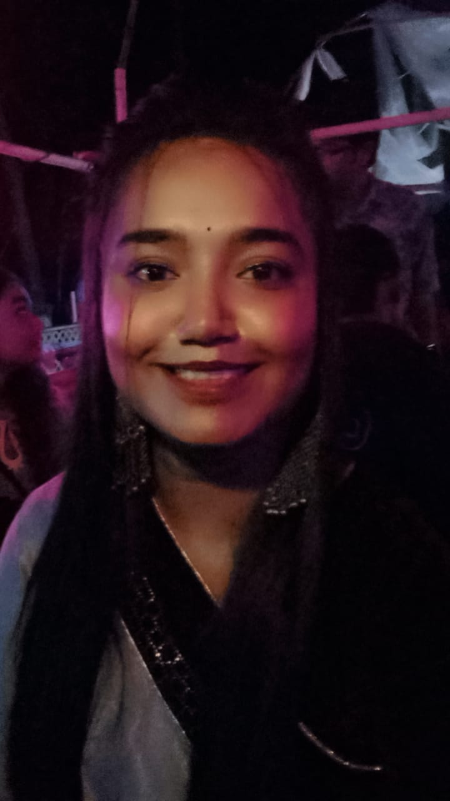

---
# title: Curriculum Vitae
summary: This is my Curriculum Vitae.
date: 2024-11-18
type: docs
math: false
# tags:
# - Curriculum Vitae
# image:
#   caption: ' '
---

  
  

    <h1>Anjuman Ekra</h1>
    
Studies at Department of Computer Science & Engineering in Jahangirnagar University

  

## Profile Summary
  
I am Anjuman Ekra, a 3rd-year Computer Science and Engineering (CSE) student with a strong passion for technology and innovation. I have hands-on experience in software development, focusing on web design, database management, and React-based projects. My expertise includes crafting user-friendly interfaces, building interactive applications like Tic-Tac-Toe, and working on complex systems such as the Digital Housing Society project. I am also skilled in problem-solving, teamwork, and delivering presentations. Constantly eager to learn and grow, I strive to merge creativity with technical skills to create impactful solutions.

---

## Education

- **Jahangirnagar University** 
  
  *Bachelor’s Degree*  
  Year of Graduation: 2019-present

- **Narayanganj Govt Mohila College**
  *HSC*  
  GPA: 5.00  
  Graduated: 2019

- **Narayanganj Govt. Girls High School** 
  *SSC*
  GPA: 5.00  
  Graduated: 2016

---

## Skills

- **Languages**: HTML, CSS, Java, C, C++
- **Frameworks**: React, Bootstrap
- **Tools**: Git, GitHub, VS Code, Figma, Paradigm
- **Other**: Responsive Web Design

---

<!-- ## Professional Experience

- **[Current/Most Recent Company/Organization Name]**  
  *Front-End Developer*  
  [Employment Duration]  
  - Developed and maintained responsive websites and applications.
  - Collaborated with designers and back-end developers to create seamless user experiences.
  - Improved website performance and ensured cross-browser compatibility.
  - Implemented new features and optimized existing code. -->

## Projects

<!-- - **[Portfolio Website]**: Developed a personal portfolio website showcasing projects, skills, and experience. -->
- **[Web Development Projects]**:

-Tic-Tac-Toe

-Tribute page

-Accessibility Building Page

-Technical Documntation

- **[Robotics Project]**:

-Line Following Robot (LFR)

-Robo Soccer

-Maze Solve

---

## Additional Experience

- **Teaching**: Provided private tuition and conducted classes at school, gaining experience in helping students understand complex concepts effectively.

---

## Certifications

- **FreeCodeCamp**: Responsive Web Design Certification
- **Buet Robotics Society**: Robotics Competition
- **Science Curnival 3.0**: Chattogram University Robot Competition

---
## Contact Me

Email: anumanekra016305@gmail.com

GitHub: https://github.com/AnjumanEkra

Phone: 01989892886

Location: Savar,Dhaka

---